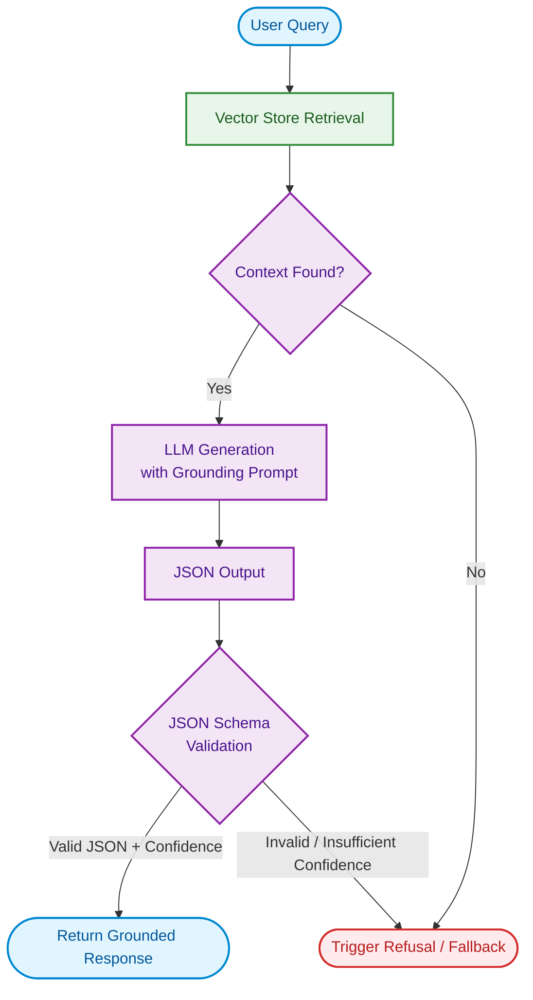

<div align="center">
  
  <h1>Clinical Grounded Generation Pipeline</h1>
  <p><em>Robust, Schema-Validated RAG Pipeline with Built-in Refusal Mechanisms</em></p>
  
  <p>
    
    
    
    
  </p>
</div>

## 📌 Overview

The **Clinical Grounded Generation Pipeline** is an advanced RAG (Retrieval-Augmented Generation) component designed to guarantee that Large Language Models (LLMs) only generate answers grounded in verified context. It employs strict JSON schema validation, rigorous prompt engineering, and deterministic refusal mechanisms to prevent hallucinations and handle off-topic queries gracefully.

This repository demonstrates how to bind LLM outputs to a strict schema and reject unverified responses, making it highly suitable for clinical and enterprise environments.

## 🏗️ Architecture



## ✨ Key Features

- **Strict Grounding Prompt:** A carefully crafted system prompt that positions the LLM as a highly constrained clinical assistant.
- **Deterministic Refusal:** Off-topic or unanswerable queries trigger a structured refusal with `confidence: "insufficient"`.
- **JSON Schema Enforcement:** Output is strictly bound to a `jsonschema` definition, forcing the LLM to provide evidence and citations for any confident claim.
- **Simulation Mode:** Run the pipeline without API keys to verify logic and schema handling against mock LLM responses.
- **Regression Testing:** Built-in validation against adversarial and off-topic test cases (`Day3_Refusal_Test_Cases.csv`).

## 🛠️ Requirements

- `python 3.10+`
- `langchain`
- `jsonschema`
- `pypdf`
- `fastembed`
- `chromadb`

## 🚀 Quick Start

1. **Clone the repository:**
   ```bash
   git clone https://github.com/ahmednashatnoaman-svg/clinical-grounded-generation.git
   cd clinical-grounded-generation
   ```

2. **Install dependencies:**
   ```bash
   pip install -r requirements.txt
   ```

3. **Explore the Notebook:**
   Open `Task3_Grounded_Generation.ipynb` to see the end-to-end pipeline in action, including the simulated LLM generation and schema validation processes.

## 📖 Design Justification
For a detailed explanation of the prompt engineering and JSON schema decisions, please refer to the [JUSTIFICATION.md](JUSTIFICATION.md) file.
